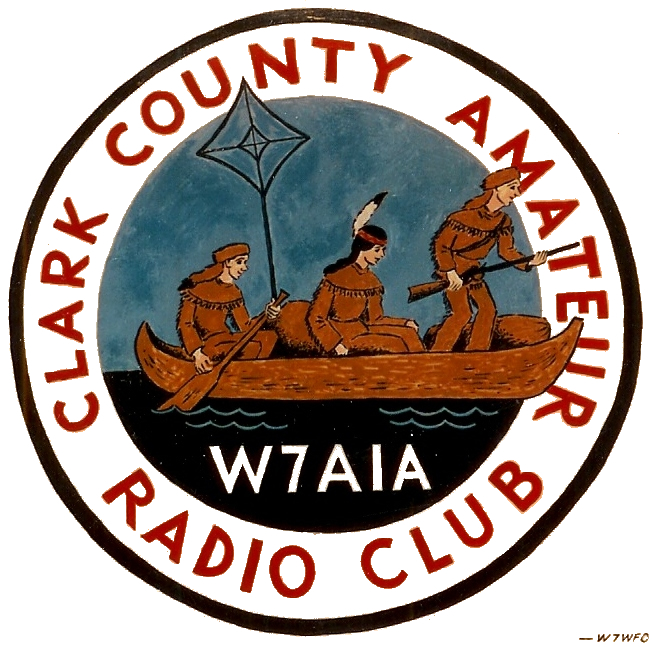
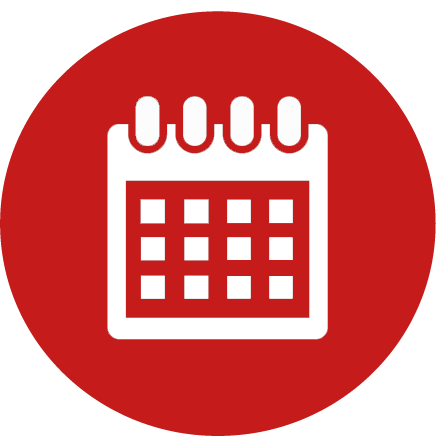
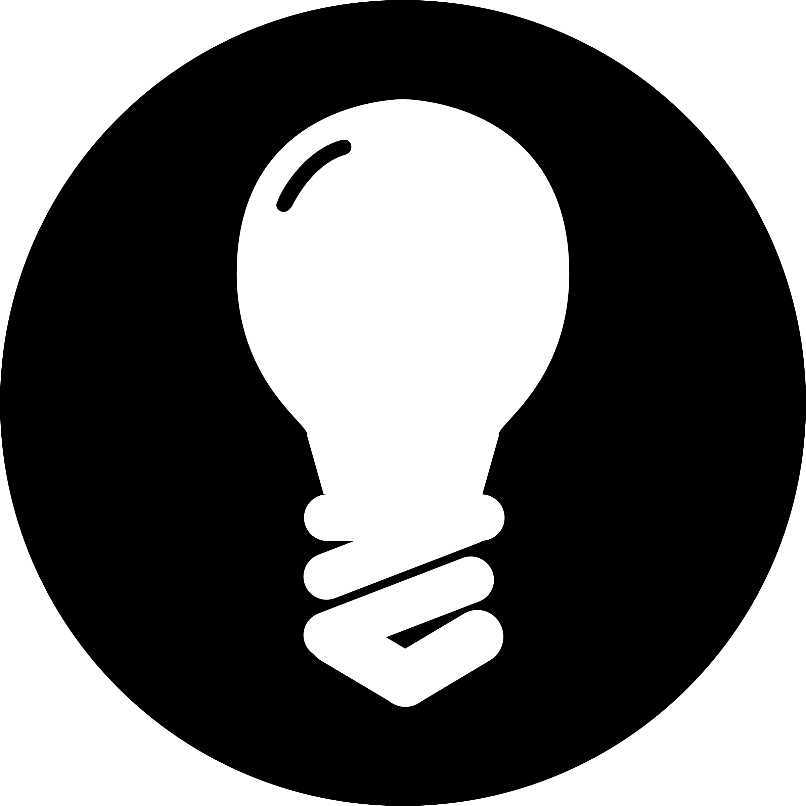

---?image=BG.jpg
## W7AIA Field Day 2018

---?image=BG.jpg
### CCARC 2018 Field Day Overview
### 2018-06-08
#### Trevor Best KG7VIP
#### Based on presentation by Tim Kuhlman KD7RUS
 CCARC Field Day 2018 by <a xmlns:cc="http://creativecommons.org/ns#" href="https://gitpitch.com/amundae/FD-pres" property="cc:attributionName" rel="cc:attributionURL">Trevor Best KG7VIP</a> is licensed under a <a rel="license" href="http://creativecommons.org/licenses/by-sa/4.0/">Creative Commons Attribution-ShareAlike 4.0 International License</a>. (excepting external content)</a>.
---?image=BG.jpg
### http://bit.do/ccfd18
### (https://gitpitch.com/amundae/KG7VIP-FD-PRES-FULL-2018#)
---?image=BG.jpg
#### Field Day is the premiere event on the radio calendar
* Every June, more than 40,000 hams throughout North America set up temporary transmitting stations in public places to demonstrate ham radio's science, skill and service to our communities and our nation. It combines public service, emergency preparedness, community outreach, and technical skills all in a single event. -**ARRL**
---?image=BG.jpg
#### Quick Facts
- Official FD Operations (radios on to radios off) run from 11:00 AM on Saturday the 23rd to 11:00 AM Sunday the 24th
- Inactive, new, or non hams can operate the GOTA station |
- You can participate at as many FD sites as you wish, as long as you don't make a QSO between them |
- The site is open to the public from noon to 4:00 PM on the 25th |
- If you want to operate, sign up with Tim AF7TM ahead of time |
---?image=BG.jpg
#### FD 2018 Goals
- Have Fun
- Recruit New Hams |
- Gain Public Attention, have 300 + People visit the site |
- Educational Events ~ hold 3 seminars |
- Contact all 50 States |
- Make 1100 Contacts |
- Field 60 radio operators during the 24 hour on-the-air operating period |
- Drink Coffee :) |
---?image=BG.jpg
### Schedule

---?image=BG.jpg
### Friday, June 22nd
<table>
  <tr>
    <th>Time</th>
    <th>Event</th>
  </tr>
  <tr>
    <td>9:00 AM</td>
    <td>Equipment crew meet at FD site</td>
  </tr>
  <tr class="fragment">
    <td>10:00 AM</td>
    <td>Set up volunteers meet at FD site</td>
  </tr>
  <tr class="fragment">
    <td>10:00 AM thru 7:00 PM</td>
    <td>Site setup begins</td>
  </tr>
  <tr class="fragment">
    <td>~Noon</td>
    <td>Lunch from Subway</td>
  </tr>
  <tr class="fragment">
    <td>7:00 PM to 8:00 PM</td>
    <td>Ice cream Social</td>
  </tr>
  <tr class="fragment">
    <td>8:00 PM</td>
    <td>Security shifts begin</td>
  </tr>
</table>
---?image=BG.jpg
### Saturday, June 23rd
<table>
  <tr>
    <th>Time</th>
    <th>Event</th>
  </tr>
  <tr>
    <td>09:00 AM-11:00 PM</td>
    <td>Finalize site setup</td>
  </tr>
  <tr>
    <tr class="fragment">
    <td>10:30 AM to 4:00 PM</td>
    <td>Black Dog Hotdog Cart Onsite</td>
  </tr>
  <tr>
    <tr class="fragment">
    <td>11:00 AM to Midnight</td>
    <td>Field Day Operations active</td>
  </tr>
    <tr>
    <tr class="fragment">
    <td>11:00 AM to 4:00 PM</td>
    <td>GOTA station active</td>
  </tr>
    <tr class="fragment">
    <td>Noon to 4:00 PM </td>
    <td>Site open to the public, club and agency booths active</td>
  </tr>
    <tr>
    <tr class="fragment">
    <td>1:00 PM to 1:50</td>
    <td>Station Grounding Dave WB7ESV</td>
  </tr>
    <tr>
    <tr class="fragment">
    <td>2:00 to 2:50</td>
    <td>ARES 101</td>
  </tr>
</table>
---?image=BG.jpg
### Saturday, June 23rd Continued
<table>
<tr>
<tr class="fragment">
<td>3:00 to 3:50</td>
<td>EYEWARN by N07DE</td>
</tr>
  <tr>
    <th>Time</th>
    <th>Event</th>
  </tr>
   <tr>
    <td>6:00 PM to 7:30 PM</td>
    <td>Pot Luck</td>
  </tr>
</table>
<h3>Sunday, June 25th</h3>
<table>
  <tr>
    <th>Time</th>
    <th>Event</th>
  </tr>
  <tr>
    <td>Midnight to 11:00 AM</td>
    <td>Field Day Operations Active</td>
  </tr>
  <tr>
    <td>8:00 AM to 9:00 AM</td>
    <td>Pancake Breakfast</td>
  </tr>
  <tr>
    <td>11:00 AM</td>
    <td>Operations Cease, teardown and cleanup begin</td>
  </tr>
  </table>
---?image=BG.jpg
### Things to Keep in Mind

---?image=BG.jpg
### Things to Keep in Mind
- <td>Camping is encouraged, bring your tent or RV and stay all night
- <td>Folks will be running security through the night, stay up and keep them company, and volunteer with Stan KF7OJA yourself |
- <td>There is no food prep onsite, food for potluck should be brought onsite ready to eat |
- <td>Additionally, try to have food setup on the tables by 5:30 |
- <td>Headphones are not provided for the radios, you are encouraged to bring your own, though they are not essential |
- <td>Everyone needs to sign in when they come onsite |
---?image=BG.jpg
### Potluck
A -- F Bring a Fruit or Veggie Dish 
G -- L Bring a Salad 
M -- R Bring a Dessert 
S -- Z Bring a Side Dish 
---?image=BG.jpg
### Volunteer

---?image=BG.jpg
### Volunteers are Still Needed in Three Areas
- Setup on Friday
- Security, talk to Stan KF7OJA
- Operating, talk to Tim AF7TM
- Safety/First Aid talk to Gay KC7OEZ
- Teardown on Sunday
---?image=BG.jpg
### Setup/Teardown Activities
* Loading trucks at storage unit and unloading trucks at Field Day site
* Unloading tables and chairs to staging area until time to put up
* Putting up the food tents
* Putting up popup tents
* Putting up lights and wires
* Runing electrical cords for lighting
* Putting up chairs and tables where needed
* Putting up signs
* Hanging banners
---?image=BG.jpg
### Safety
- Designated Safety Officer is Gay Sipes KC7OEZ
- No public access in hazard zones
- Clear zone aroud antennas and guy wires
- Only Park and Camp in designated Areas
---?image=BG.jpg
#### Field Day 2018 Committee
